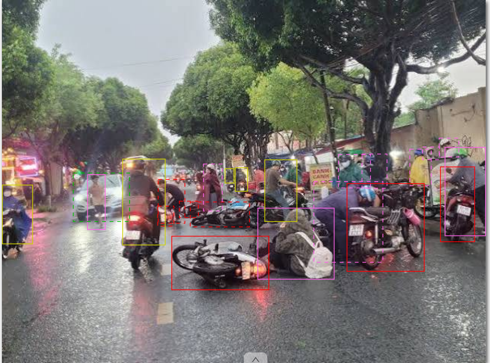

# Annotation Guideline — Road Vehicles & Human Elements Detection

**Version:** v3 (Final Post-Peer-Review Handoff)

---

## 1. Objective + Scope

- **Objective:** Cung cấp dữ liệu bounding box chuẩn xác cho bài toán nhận diện phương tiện giao thông và người tham gia giao thông phục vụ hệ thống cảnh báo va chạm (ADAS) và giám sát giao thông thông minh.
- **In-Scope (Bắt buộc gán nhãn):**
  - Mọi phương tiện cơ giới di chuyển hoặc đang đỗ trên đường: `Car`, `Motorcycle`, `Pickup`, `Truck`, `Bus`.
  - Người tham gia giao thông: `Pedestrian` (người đi bộ/không ngồi trên xe), `Driver` (người đang ngồi trên xe điều khiển xe máy hoặc xe đạp; chỉ đánh dấu người lái, không cần đánh dấu phương tiện).
  - Phương tiện bị che khuất một phần (occluded) hoặc bị cắt ở rìa ảnh (truncated) miễn là còn đủ dấu hiệu nhận dạng (≥ 20% nhìn thấy hoặc nhận diện được loại phương tiện).
  - Phương tiện hoặc người ở xa có kích thước nhỏ (chiều cao hoặc chiều rộng $\ge 8\text{px}$) nhưng mắt thường vẫn nhận diện được hình dạng.
- **Out-of-Scope (Bỏ qua - Ignore):**
  - Xe đồ chơi, mô hình quảng cáo.
  - Hình ảnh xe cộ hoặc người in trên pano, áp phích, thân xe buýt.
  - Bóng phản chiếu của xe trên mặt đường ướt hoặc cửa kính.
  - Vật thể ở cực xa có kích thước $< 8\text{px}$ hoặc nhòe mờ hoàn toàn thành đốm màu không thể xác định loại.

---

## 2. Annotation Unit

- **Đơn vị nhãn:** Bounding box 2D hình chữ nhật (`rectangle`) cho từng cá thể độc lập (instance-level).
- **Quy tắc quan trọng cho `Driver` và `Pedestrian`:**
  - **`Driver` CHỈ áp dụng khi:** Người đang **ngồi trên xe** và **trực tiếp điều khiển xe máy hoặc xe đạp**.
  - **Box `Driver` CHỈ ĐÁNH DẤU NGƯỜI LÁI, KHÔNG CẦN ĐÁNH DẤU PHƯƠNG TIỆN:** Bounding box chỉ ôm khít cơ thể người điều khiển (từ đầu/mũ bảo hiểm xuống đến phần thấp nhất của cơ thể người lái như chân/bàn chân), **không trùm thân xe** hay bánh xe của phương tiện bên dưới, và **không cần đánh dấu phương tiện** đang được điều khiển.
  - **Không ngồi trên xe -> `Pedestrian`:** Bất kỳ ai không ngồi trên xe (đang đi bộ, chạy, đứng cạnh xe, dắt bộ xe máy/xe đạp) đều bắt buộc gán nhãn là **`Pedestrian`**.
  - **Quy tắc xe máy bị ngã/tai nạn (Fallen / Accident Motorcycles - EC-09):** Nếu xe máy bị tai nạn đổ ngã ra đường và người đã văng khỏi xe, gán xe máy là `Motorcycle`, còn người nằm/ngồi trên đường là `Pedestrian`. Chỉ gán `Driver` khi người vẫn đang ngồi trên xe.
- **Quy tắc quan trọng cho `Car`:**
  - Label toàn bộ chiếc xe, bắt buộc ôm trọn vẹn cả **bánh xe** (tiếp xúc mặt đường) và **gương chiếu hậu** (hai bên xe).
- **Quy tắc mật độ cao / Chùm phương tiện (Dense Clusters & Swarms):**
  - Khi nhiều xe máy hoặc ô tô chen chúc (như ở ngã tư đèn đỏ hoặc ùn tắc): vẽ từng box riêng cho từng cá thể. Chấp nhận các box đè/chồng lấn lên nhau (overlap).

---

## 3. Geometry Rule

- **Loại hình:** Rectangle (hộp chữ nhật song song với trục tọa độ x-y).
- **Độ khít (Tightness):** Hộp phải ôm **khít toàn bộ các pixel nhìn thấy** (visible pixels) của đối tượng:
  - **Đối với `Car`:** Bounding box phải bao phủ **toàn bộ xe, gồm cả bánh xe và gương chiếu hậu**, cản trước, cản sau, giá nóc (nếu có).
  - **Đối với `Driver`:** Bounding box chỉ ôm khít người điều khiển (từ đỉnh đầu/mũ bảo hiểm của người lái xuống tới điểm thấp nhất của cơ thể như chân/bàn chân), **không bao gồm chiếc xe máy/xe đạp bên dưới** và **không cần đánh dấu phương tiện** đang điều khiển.
  - **Đối với `Bus` / `Truck`:** Ôm sát nóc xe, gương tai thỏ lớn, và mép dưới cùng của gầm xe/bánh xe nhìn thấy.
  - **Đối với `Motorcycle` (không người):** Ôm sát toàn bộ thân xe, tay lái, bánh xe và biển số xe đỗ.
  - **KHÔNG bao gồm:** Bóng đổ (shadow) của xe trên mặt đường, khói xả, vệt sáng đèn pha rọi ra ngoài.
- **Dung sai (Tolerance):** Độ lệch mép hộp không quá **±2 pixel** so với điểm biên ngoài cùng của vật thể.
- **Không vẽ Amodal:** Chỉ vẽ trên phần nhìn thấy, không tưởng tượng phần bị che khuất ngầm dưới lòng đất hay sau xe khác.

---

## 4. Taxonomy & Attribute Definition

### 4.1 Danh sách Class (Object Classes)

| Class | Định nghĩa & Tiêu chí nhận diện | Yêu cầu Bounding Box đặc biệt | Ví dụ trong Edge Cases |
|---|---|---|---|
| **`Car`** | Xe con, xe du lịch chở người từ 4–9 chỗ, sedan, hatchback, SUV, crossover, xe taxi. | **Bắt buộc ôm cả xe gồm bánh xe và 2 gương chiếu hậu.** Không cắt cụt gương xe hay bánh xe. | Ô tô chạy trên đường, ô tô đỗ bên lề. |
| **`Driver`** | Người đang **ngồi trên xe và trực tiếp điều khiển xe máy hoặc xe đạp**. | **CHỈ ôm khít người lái xe máy/xe đạp, KHÔNG cần đánh dấu phương tiện** (không vẽ xe). | Người đi xe máy trong chùm xe đông đúc ở ngã tư. |
| **`Pedestrian`** | Người đi bộ hoặc **bất kỳ ai KHÔNG ngồi trên xe**: đứng, đi, chạy, dắt xe máy, đẩy xe nôi. | Ôm khít cơ thể người (từ đầu đến chân, gồm ba lô/túi xách). | Người đi bộ cạnh hàng xe máy đỗ, người băng qua đường. |
| **`Motorcycle`** | Xe 2 bánh hoặc 3 bánh gắn động cơ **đang đỗ hoặc không có người ngồi trên xe điều khiển**. | Ôm trọn vẹn thân xe máy đỗ bên đường / trong bãi đỗ. | Xe máy dựng thành hàng dọc trên vỉa hè (`images (1).jpg`). |
| **`Bus`** | Xe khách chở nhiều người (thường ≥ 16 chỗ), xe buýt công cộng nội đô, xe khách liên tỉnh. | Ôm toàn bộ thân xe buýt, kính trước, gương chiếu hậu lớn. | Xe buýt đi giữa dòng xe máy đông đúc (`images.jpg`). |
| **`Pickup`** | Xe bán tải: cabin kín phía trước và **thùng chở hàng hở (open cargo bed)** tách biệt phía sau. | Ôm toàn bộ xe gồm bánh xe, gương chiếu hậu và thùng xe. | Ford Ranger, Toyota Hilux, Mitsubishi Triton. |
| **`Truck`** | Xe tải chở hàng hạng trung và nặng: thùng xe lớn, xe ben, xe bồn, xe đầu kéo container. | Ôm toàn bộ đầu kéo và rơ-moóc/thùng hàng kèm theo. | Xe tải chở hàng, xe bồn, container. |

### 4.2 Thuộc tính (Attributes)

| Attribute | Kiểu | Giá trị | Tiêu chí đánh dấu (`true`) |
|---|---|---|---|
| **`occluded`** | Checkbox | `true` / `false` | Đánh dấu khi đối tượng bị **vật khác che khuất một phần** (bị xe khác che, bị cây xanh, cột đèn, biển báo hoặc người che mất > 10% diện tích). Ví dụ: Xe buýt bị xe máy che cản trước; người lái xe máy đi sát sau xe khác bị che bánh trước. |
| **`truncated`** | Checkbox | `true` / `false` | Đánh dấu khi đối tượng **chạm hoặc vượt ra ngoài mép ảnh** (bị cắt cụt đầu, đuôi, nóc hoặc bánh xe do góc nhìn camera). |

---

## 5. Inclusion / Exclusion Details & Edge Cases

1. **Người điều khiển vs Người đi bộ trong cảnh hỗn hợp (`images (1).jpg`):**
   - Đang ngồi trên yên xe và cầm lái -> **`Driver`** (box chỉ ôm khít người lái xe máy/xe đạp, không cần đánh dấu phương tiện).
   - Đang dắt bộ xe máy / xe đạp -> Người là **`Pedestrian`**, xe đang dắt là **`Motorcycle`** (tách riêng 2 box).
   - Người đứng cạnh xe, đi bộ trên vỉa hè luồn lách qua hàng xe máy -> **`Pedestrian`** (nếu bị xe che chân, tích `occluded: true`).
2. **Hàng xe máy đỗ (`Motorcycle` vs `Driver`):**
   - Các xe máy dựng nối tiếp nhau trên vỉa hè hoặc lòng đường không có người ngồi trên -> Label từng chiếc là **`Motorcycle`**.
3. **Chùm xe máy đông đúc ở ngã tư / đường phố (`images.jpg`, `img3.jpg`):**
   - Dòng xe máy di chuyển sát nhau: vẽ box `Driver` riêng cho từng người lái xe (chỉ ôm khít người lái, không cần đánh dấu phương tiện).
   - Người lái xe máy đi sau bị người hoặc xe trước che khuất một phần -> đánh dấu **`occluded: true`**.
4. **Xe buýt to lớn giữa đám đông xe máy (`images.jpg`):**
   - Label toàn bộ chiếc xe buýt là `Bus`.
   - Phần cản trước hoặc gầm xe bị các xe máy phía trước che lấp -> đánh dấu xe buýt là **`occluded: true`**.
5. **Vật thể nhỏ ở xa ngã tư (`img3.jpg`):**
   - Kích thước nhỏ xuống tới khoảng **$8 - 12\text{px}$**: nếu vẫn phân biệt được đó là người lái xe máy (`Driver`) hay ô tô (`Car`) -> **BẮT BUỘC LABEL**.
   - Chỉ bỏ qua nếu $< 8\text{px}$ và không thể nhận dạng hình thái.
6. **Xe con (`Car`):**
   - Bắt buộc kiểm tra và bao gồm đầy đủ **bánh xe tiếp đất** và **gương chiếu hậu 2 bên**.
7. **Hiện trường tai nạn / Xe máy ngã đổ trên mặt đường ướt (`image.png`):**
   - **Xe máy ngã nằm ngang trên đường:** Gán nhãn là **`Motorcycle`**. Bounding box ôm khít toàn bộ chiếc xe máy nằm ngang (từ bánh trước, bánh sau, lốc máy và tay lái). Tích `occluded: true` nếu bị người hoặc xe khác che mất một phần. Bắt buộc **cắt bỏ vệt bóng phản chiếu đèn xe trên vũng nước mưa**.
   - **Người ngồi bệt trên mặt đường cạnh xe:** Gán nhãn là **`Pedestrian`** (vì không ngồi trên xe điều khiển xe). Bounding box ôm trọn cơ thể người ngồi (gồm mũ bảo hiểm, áo khoác, ba lô).
   - **Người đứng/khom lưng hỗ trợ nâng xe:** Gán nhãn là **`Pedestrian`** (tích `occluded: true` nếu bị xe che chân).
   - **Người điều khiển xe máy khác đang lưu thông qua:** Gán nhãn là **`Driver`** (chỉ vẽ ôm người lái từ đầu tới chân theo quy tắc mới v2, không vẽ xe).

---

## 6. Visibility & Occlusion Rule

- **Che khuất 10% – 80%:** Label bình thường và tích chọn `occluded: true`.
- **Che khuất > 80% (Heavy Occlusion):**
  - Nếu vẫn nhận diện chắc chắn loại xe/người (ví dụ thấy mũ bảo hiểm + đầu xe máy quen thuộc, hoặc nóc xe ô tô): Vẫn label box visible pixel và chọn `occluded: true`.
  - Nếu chỉ thấy một đốm màu mơ hồ, không thể xác định loại đối tượng: **BỎ QUA (Ignore)**.
- **Rìa ảnh (Truncation):** Mép box kéo sát tới pixel cuối cùng của khung ảnh (x=0, y=0 hoặc x=width, y=height), và tích chọn `truncated: true`.

---

## 7. Ambiguity & Escalation Path

| Tình huống mập mờ trong Edge Cases | Quyết định chuẩn | Lý do |
|---|---|---|
| **Nhiều xe máy chen chúc che khuất lẫn nhau** | Vẽ từng box **`Driver`** riêng cho từng người lái xe, tích **`occluded: true`** cho người bị che | Tập trung phát hiện chính xác người điều khiển tham gia giao thông. |
| **Xe máy đỗ san sát nhau trên vỉa hè** | Vẽ từng box **`Motorcycle`** độc lập, tích **`occluded: true`** | Phân biệt rõ xe tĩnh không người với người lái xe di động. |
| **Người lái xe máy chở người phía sau (chở 2, chở 3)** | Box **`Driver`** cho người lái chính (chỉ ôm người lái). Người ngồi sau vẽ riêng **`Pedestrian`** nếu lộ rõ. Không cần đánh dấu phương tiện | Phân biệt độc lập các cá thể người. |
| **Xe buýt bị xe máy che mất nửa dưới đầu xe** | Vẽ box `Bus` trùm từ nóc xe xuống mép cản thấp nhất nhìn thấy, tích **`occluded: true`** | Xe buýt có diện tích lớn, phần che khuất < 30%. |
| **Xe ở khoảng cách xa gần đường chân trời ($w \approx 10\text{px}$)** | Nếu nhận ra bóng dáng ô tô/người lái -> **Label**. Nếu chỉ là chấm sáng -> **Ignore** | Tối ưu hóa cho mô hình phát hiện vật thể tầm xa. |

---

## 8. Temporal Rule

- **Quy tắc thời gian:** **Không áp dụng — task ảnh tĩnh (Static 2D Detection).** Mỗi ảnh được gán nhãn độc lập dựa trên frame hiện tại.

---

## 9. Examples & Reference Cases (Updated from Edge Cases)

| Case | Loại tình huống | Expected Output | Ghi chú & Rule thực tế |
|---|---|---|---|
| **Xe ô tô con chạy trên đường** | Normal | Label `Car`, `occluded: false`, `truncated: false` | **Box ôm toàn bộ xe, gồm bánh xe chạm đất và 2 gương chiếu hậu.** |
| **Người lái xe máy trên đường** | Driver | Label `Driver`, `occluded: false`, `truncated: false` | **Chỉ đánh dấu người lái xe máy/xe đạp, box ôm khít cơ thể người lái, không cần đánh dấu phương tiện.** |
| **Chùm xe máy chen chúc ở ngã tư (`images.jpg`)** | Edge (Density) | Mỗi người lái 1 box `Driver`, tích `occluded: true` cho người bị che | Chỉ đánh dấu người lái, các box overlap nhau bình thường. |
| **Hàng xe máy đỗ trên vỉa hè (`images (1).jpg`)** | Edge (Parked) | Mỗi xe 1 box `Motorcycle`, `occluded: true` nếu bị xe bên cạnh che | Xe đỗ không người lái -> `Motorcycle`. |
| **Người đi bộ cạnh hàng xe máy (`images (1).jpg`)** | Edge (Interaction) | Label `Pedestrian`, `occluded: true` nếu bị xe che chân | Không ngồi trên xe -> bắt buộc là `Pedestrian`. |
| **Xe buýt đi giữa dòng xe máy (`images.jpg`)** | Edge (Occlusion) | Label `Bus`, `occluded: true`, `truncated: false` | Thân xe buýt lớn, xe máy che cản dưới. |
| **Phương tiện nhỏ ở xa ngã tư (`img3.jpg`)** | Edge (Small/Far) | Label `Driver` hoặc `Car` với kích thước $w, h \approx 8-15\text{px}$ | Nhận diện được đặc trưng là bắt buộc gán nhãn. |
| **Xe con bị cắt nửa thân ở rìa ảnh (`images (2).jpg`)** | Truncation | Label `Car`, `occluded: false`, `truncated: true` | Mép box chạm sát biên ảnh (x=0 hoặc y=0). |
| **Bóng xe in trên mặt đường nhựa** | Negative | **Không vẽ box** | Bóng đổ không phải là bộ phận cơ học của xe. |
| **Hiện trường xe máy ngã đổ & người ngồi bệt trên đường mưa (`image.png`)** | Edge (Accident / Wet Road) | Xe ngã = `Motorcycle` (ôm thân xe nằm ngang, bỏ bóng nước); Người ngồi bệt = `Pedestrian`; Người nâng xe = `Pedestrian`; Người đang chạy xe qua = `Driver` (chỉ ôm người). | Tách bạch rõ trạng thái xe tĩnh/ngã với người đi bộ và người lái xe di động. |

### Minh họa Edge Case: Hiện trường xe máy ngã đổ & người ngồi bệt trên mặt đường ướt

> [!NOTE]
> **Phân tích Ground Truth & Quy tắc gán nhãn cho case `image.png` (EC-09):**
> 1. **Xe máy bị ngã nằm ngang trên mặt đường (`Motorcycle`):**
>    - **Class:** `Motorcycle` (không gán `Driver` vì xe không có người ngồi trên yên điều khiển).
>    - **Geometry & Boundary:** Bounding box phải bao trọn thân xe nằm ngang, tay lái, bánh xe và biển số xe.
>    - **Quy tắc bóng nước:** Đáy của box phải kết thúc chính xác tại điểm tiếp xúc cơ học giữa lốp/khung xe với mặt đường nhựa; **tuyệt đối không kéo box trùm vệt phản chiếu ánh đèn xe/đèn đường trên vũng nước**.
> 2. **Người ngồi bệt trên mặt đường sau tai nạn (`Pedestrian`):**
>    - **Class:** `Pedestrian` (theo quy tắc mục 2: Bất kỳ ai không ngồi trên xe đều là `Pedestrian`, bất kể trước đó là người lái bị ngã).
>    - **Attributes:** `occluded: false`, `truncated: false`.
> 3. **Người cúi xuống đỡ/nâng xe máy (`Pedestrian`):**
>    - **Class:** `Pedestrian` (người đứng trợ giúp, không điều khiển xe).
>    - **Attributes:** `occluded: true` (chân/nửa thân dưới bị che khuất một phần bởi xe máy nằm chắn phía trước).
>    - **Instance Overlap:** Box `Pedestrian` của người này và box `Motorcycle` của xe máy được phép chồng lấn (overlap) tự nhiên.
>    4. **Người điều khiển xe máy khác đang chạy ngang qua (`Driver`):**
>    - **Class:** `Driver` (người đang ngồi trên xe và trực tiếp điều khiển xe máy).
>    - **Quy tắc Driver mới:** Bounding box chỉ ôm khít cơ thể người lái từ đỉnh mũ bảo hiểm xuống bàn chân; **tuyệt đối không bao gồm khung xe hay bánh xe bên dưới, và không cần đánh dấu phương tiện**.

---

## 10. Common Mistakes & Pre-Submission Checklist

### 10.1 Các lỗi thường gặp (Common Mistakes)
1. ❌ **Cắt cụt gương chiếu hậu hoặc bánh xe của `Car`:** Vẽ box chỉ ôm khung vỏ mà bỏ quên gương 2 bên hoặc mép dưới lốp xe.
2. ❌ **Bỏ quên người lái trong chùm xe máy:** Trong cảnh đông đúc, bỏ sót các xe máy nhỏ đi xen kẽ hoặc ở xa ngã tư.
3. ❌ **Nhầm lẫn phạm vi box `Driver`:** Vẽ box trùm cả chiếc xe máy/xe đạp (Đúng: `Driver` chỉ đánh dấu người lái xe máy hoặc xe đạp, ôm khít người lái, không cần đánh dấu phương tiện).
4. ❌ **Bỏ sót checkbox `occluded` trong đám đông:** Xe máy chen chúc nhau che khuất bánh trước nhưng quên không tích `occluded: true`.
5. ❌ **Bỏ qua vật thể nhỏ ở ngã tư ($8-15\text{px}$):** Nhầm tưởng vật thể nhỏ là Ignore dù vẫn nhìn rõ hình bóng xe.

### 10.2 Bảng Checklist tự kiểm tra trước khi bấm Submit (Pre-Submission Checklist)

Annotator bắt buộc rà soát 6 bước sau trước khi bấm **Save** và nộp bài:
- [ ] **1. Quét đối tượng nhỏ (Small Object Scan):** Phóng to (zoom) quét toàn cảnh các ngã tư, làn đường phía xa và đường chân trời; đảm bảo không bỏ sót bất kỳ phương tiện hoặc người nào có kích thước $\ge 8\text{px}$.
- [ ] **2. Kiểm tra độ khít hình học (Geometry Tightness):** Zoom 200% kiểm tra:
  - Box `Car` / `Truck` / `Bus`: Đã chạm đáy mặt đường (tiếp xúc lốp xe) và trùm trọn 2 gương chiếu hậu.
  - Box `Driver`: Chỉ ôm khít từ đỉnh mũ bảo hiểm xuống bàn chân người lái; tuyệt đối không vẽ trùm xe máy/xe đạp.
  - Box `Motorcycle` (xe đỗ/xe ngã): Ôm sát mép ngoài cùng của xe, không lan ra bóng đổ.
- [ ] **3. Lọc thuộc tính `occluded` (Occlusion Filter Check):** Dùng tính năng Filter trên CVAT lọc các box có `occluded == false`. Rà soát lại xem có đối tượng nào bị xe khác đè lên trên > 20% mà chưa được bật `occluded: true` hay không.
- [ ] **4. Rà soát rìa ảnh (Truncation Boundary):** Kiểm tra mọi box nằm ở mép ngoài cùng của bức ảnh (chạm tọa độ x=0, y=0 hoặc mép phải/dưới) đã được tích chọn `truncated: true`.
- [ ] **5. Loại trừ bóng nước & phản chiếu (Reflection Exclusion):** Ở các cảnh trời mưa hoặc ban đêm ướt đường, kiểm tra đáy các bounding box đã cắt đứt bóng nước phản chiếu chưa.
- [ ] **6. Không còn box thừa / box rác:** Kiểm tra danh sách đối tượng (Objects list) xem có box nào vô tình bấm nhầm tạo ra kích thước $0\times 0\text{px}$ hay không.

---

## 11. Quy trình Đánh dấu Nghi ngờ cho QA Review (Uncertainty & Escalation Flag)

Khi annotator **không tự tin (uncertain)** vào một đối tượng cụ thể (ví dụ: vật thể ở cự ly xa bị nhòe mờ không rõ `Car` hay `Pickup`, vật thể bị che khuất > 70%, hoặc hiện trường va chạm bất thường), **tuyệt đối không đoán mò** và **không tự ý bỏ qua**. Hãy thực hiện quy trình đánh dấu sau:

### 11.1 Cách tạo Flag đánh dấu trong CVAT
1. **Vẽ Bounding Box tạm thời:** Vẫn vẽ một bounding box ôm sát vật thể theo phán đoán tốt nhất có thể (best-effort label).
2. **Tạo CVAT Issue trực tiếp trên đối tượng:**
   - Bấm chuột phải vào bounding box đó trên ảnh (hoặc rê chuột vào box và bấm phím tắt **`I`** - *Open an Issue*).
   - Đặt con trỏ comment tại vị trí cần lưu ý trên box.
3. **Cú pháp ghi chú chuẩn (Standard Tag Syntax):**
   - Bắt đầu bình luận bằng tiền tố `[UNCERTAIN]` hoặc `[QA-CHECK]`.
   - Nêu ngắn gọn lý do không tự tin. Ví dụ:
     - `[UNCERTAIN] Xe ở xa cự ly > 50m, không rõ là SUV hay Pickup do phần đuôi bị mờ.`
     - `[UNCERTAIN] Người đứng cạnh xe máy có đang dắt xe hay chuẩn bị leo lên xe (Pedestrian vs Driver)?`
     - `[UNCERTAIN] Góc khuất > 75%, chỉ nhìn thấy một phần bánh xe và đèn hậu.`
4. **Trạng thái Issue:** Issue sau khi tạo sẽ ở trạng thái **`Open`**. Giữ nguyên trạng thái này khi submit task.

### 11.2 Quy trình QA Lead xử lý
- **Lọc và phân xử:** QA Lead mở task, chọn bộ lọc **Issues: Open** để duyệt qua 100% các điểm nghi ngờ được đánh dấu.
- **Quyết định nhãn:**
  - Nếu guideline đã có quy tắc tương ứng: QA điều chỉnh nhãn/box chuẩn xác, phản hồi giải thích vào comment.
  - Nếu là tình huống mới chưa có trong guideline (Guideline Gap): QA escalate lên **Spec Owner** để ra quyết định và ghi nhận vào `08_revision_log.md`.
- **Đóng cờ:** Sau khi giải quyết xong, QA Lead chuyển trạng thái Issue sang **`Resolved`** và **`Closed`**. Bất kỳ batch nào còn Issue ở trạng thái `Open` sẽ không được cấp chứng nhận vượt qua Quality Gate.
